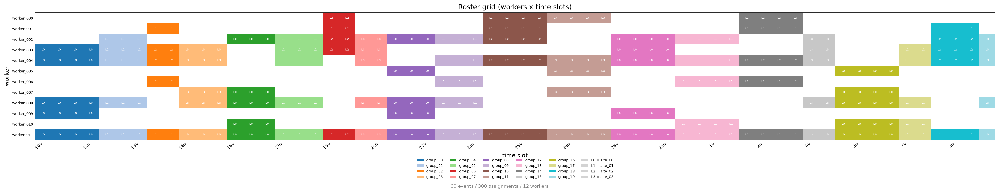
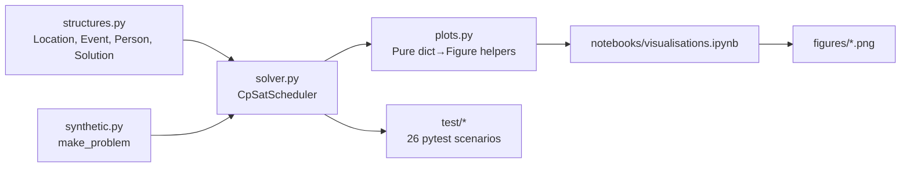

# Roster-Solver: CP-SAT Event Scheduler

**Assign workers to bike-riding and road-safety training events** while respecting skills, availability, location preferences, and fairness — powered by Google OR-Tools CP-SAT.



## Quick Demo

```bash
# Install dependencies (requires Python 3.12+)
uv sync

# Run the built-in example
uv run python -m roster_solver.solver
```

## Problem

A non-profit runs weekly road-safety training sessions at schools across a city. Each session needs a team of workers with specific certifications (mechanic, first-aid, leader). Workers have varying availability, location preferences, and priority levels. The goal: **build a weekly schedule that satisfies all hard constraints while minimising inconvenience** — keeping teams consistent across a class's sessions, respecting seniority, distributing workload fairly, and preferring local workers.

This is a constrained assignment problem with combinatorial complexity. Roster-Solver formulates it as a CP-SAT model and solves it with Google OR-Tools.

## Features

| Category | Details |
|----------|---------|
| **Hard constraints** | Exact staffing per event, per-skill minimums (2 mech / 2 first-aid / 1 leader), no double-booking |
| **Soft objectives** | 5 weighted terms: same-group team consistency, priority level, same-location consistency, availability-weighted fairness, neighbourhood preference |
| **Lexicographic weights** | Default coefficients (100k / 10k / 1k / 1 / 1) approximate strict priority ordering |
| **Reproducible benchmarks** | Seeded synthetic problem generator with feasibility pre-check |
| **Visualisations** | 4 notebook-driven figures: roster grid, solver scaling, gap decay, fairness comparison |

## Architecture



## Installation

```bash
# With uv (recommended)
uv sync

# Or with pip
pip install -e ".[dev]"
```

Requires Python ≥ 3.12. Core dependency: `ortools ≥ 9.10`.

## Usage

### As a Library

```python
from roster_solver.solver import CpSatScheduler
from roster_solver.synthetic import make_problem
from roster_solver.structures import DEFAULT_COEFFICIENTS

# Generate or load your (events, workers)
events, workers = make_problem(n_workers=30, n_events=20, seed=42)

# Solve with default lexicographic weights
scheduler = CpSatScheduler(events, workers)
solution = scheduler.solve(max_seconds=30.0)

if solution:
    print(solution.to_json(events))
    print("Objective breakdown:", scheduler.objective_breakdown())
```

### Custom Objective Weights

```python
# Disable team consistency, emphasise fairness
custom = {"same_group": 0, "proportional_split": 100}
solution = scheduler.solve(coefficients=custom)
```

### Run Tests

```bash
uv run pytest -v
```

### Regenerate Figures

```bash
PYTHONPATH=src uv run python -m nbconvert \
    --to notebook --execute notebooks/visualisations.ipynb --inplace
```

## Visualisations

| Figure | Description |
|--------|-------------|
| `roster_grid.png` | Worker × time-slot heatmap showing team consistency and no double-booking |
| `scaling.png` | Wall time & model size vs total staffing demand; OPTIMAL → FEASIBLE transition |
| `gap_decay.png` | Incumbent vs best bound over a 30s solve (balanced weights) |
| `fairness.png` | Workload distribution with/without `proportional_split` term |

## Project Structure

```
src/roster_solver/
  structures.py   # Location, Event, Person, Solution + constants
  solver.py       # CpSatScheduler (CP-SAT model + solve)
  synthetic.py    # Seeded generator of anonymised (events, workers)
  plots.py        # Pure dict-in / Figure-out plotting helpers
  utils.py        # bidict, groupby_unsorted
notebooks/
  visualisations.ipynb   # Runs solver experiments, saves figures/
test/             # pytest suite (scenarios in test/conftest.py)
figures/          # Generated PNG outputs
```

## License

MIT License — see [LICENSE](LICENSE) for details.